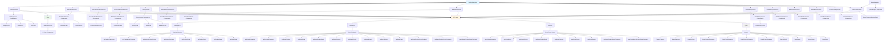

# Brand Catalog Feature Structure

```mermaid
graph TD
    A[CatalogNavigator] --> B[CatalogScreen]
    A --> C[BrandDetailScreen]
    A --> D[BrandProductBookScreen]
    A --> E[BrandProductDetailScreen]
    A --> F[SurveyScreen]
    A --> G[BrandEventsDetailScreen]
    A --> H[BrandEventDetail]
    A --> I[BrandHistoryScreen]
    A --> J[BrandSurveyListScreen]
    A --> K[BrandPostListScreen]
    A --> L[BrandEventsScreen]
    A --> M[ProductCatalogScreen]
    A --> N[NewsDetailScreen]
    
    B --> O[CatalogScreen Components]
    O --> P[CategoryCard]
    O --> Q[BrandCard]
    O --> R[FilterTabs]
    
    C --> S[BrandDetailScreen Components]
    S --> T[BrandInfoCard]
    S --> U[ActionButtons]
    
    D --> V[BrandProductBookScreen Components]
    V --> W[BrandProductInfoCard]
    
    E --> X[BrandProductDetailScreen Components]
    X --> Y[ProductInfoCard]
    
    F --> Z[SurveyScreen Components]
    Z --> AA[SurveyCard]
    Z --> AB[EventCard]
    Z --> AC[BrandInfoCard]
    
    G --> AD[BrandEventsDetailScreen Components]
    H --> AE[BrandEventDetail Components]
    
    I --> AF[BrandHistoryScreen Components]
    AF --> AG[PointsHistoryCard]
    
    J --> AH[BrandSurveyListScreen Components]
    K --> AI[BrandPostListScreen Components]
    L --> AJ[BrandEventsScreen Components]
    
    N --> AK[NewsDetailScreen Components]
    N --> AL[NewsCommentsBottomSheet]
    
    AM[API Layer] --> AN[catalogApi.ts]
    AM --> AO[brandApi.ts]
    AM --> AP[hooks.ts]
    
    AN --> AQ[Catalog Endpoints]
    AQ --> AR[getCatalogCategories]
    AQ --> AS[getCatalogSubCategories]
    AQ --> AT[getCatalogProductGroups]
    AQ --> AU[getCatalogProducts]
    AQ --> AV[getProductDetail]
    AQ --> AW[getProductPosts]
    AQ --> AX[getProductNews]
    AQ --> AY[getNewsDetail]
    
    AO --> AZ[Brand Endpoints]
    AZ --> BA[getBrandCategories]
    AZ --> BB[getBrandsByCategory]
    AZ --> BC[getBrandCatalog]
    AZ --> BD[getBrandFeed]
    AZ --> BE[getBrandProductBook]
    AZ --> BF[getBrandSurveys]
    AZ --> BG[getBrandTrends]
    AZ --> BH[getBrandEvents]
    AZ --> BI[getBrandHistory]
    AZ --> BJ[getBrandStats]
    AZ --> BK[getBrandProductGroupProducts]
    AZ --> BL[getBrandProductNewsComments]
    AZ --> BM[createBrandProductNewsComment]
    
    AP --> BN[React Query Hooks]
    BN --> BO[useCatalogCategories]
    BN --> BP[useBrandCategories]
    BN --> BQ[useBrandCatalog]
    BN --> BP[useBrandFeed]
    BN --> BR[useBrandProductBook]
    BN --> BS[useBrandSurveys]
    BN --> BT[useBrandTrends]
    BN --> BU[useBrandEvents]
    BN --> BV[useBrandProductNewsComments]
    BN --> BW[useCreateBrandProductNewsComment]
    
    B --> AM
    C --> AM
    D --> AM
    E --> AM
    F --> AM
    G --> AM
    H --> AM
    I --> AM
    J --> AM
    K --> AM
    L --> AM
    N --> AM
    
    BX[Types] --> BY[types.ts]
    BY --> BZ[CatalogCategory]
    BY --> CA[BrandCategory]
    BY --> CB[BrandListItem]
    BY --> CC[BrandCatalogResponse]
    BY --> CD[BrandFeedResponse]
    BY --> CE[BrandSurveysResponse]
    BY --> CF[BrandEventsResponse]
    BY --> CG[ProductDetail]
    BY --> CH[NewsDetail]
    BY --> CI[BrandHistory]
    BY --> CJ[BrandStats]
    
    AM --> BX
    
    CK[Store] --> CL[catalogUIStore.ts]
    CL --> CM[UI State Management]
    
    B --> CK
    
    CN[NewsNavigator] --> N
    CN --> CO[RootNavigator Integration]
    
    style A fill:#e1f5ff
    style AM fill:#fff4e1
    style BX fill:#f0f0f0
    style CK fill:#e8f5e9
```
