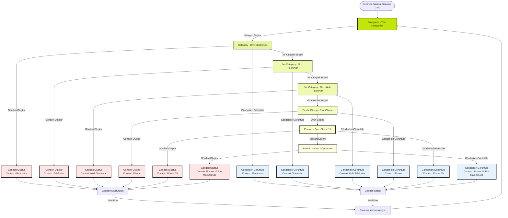
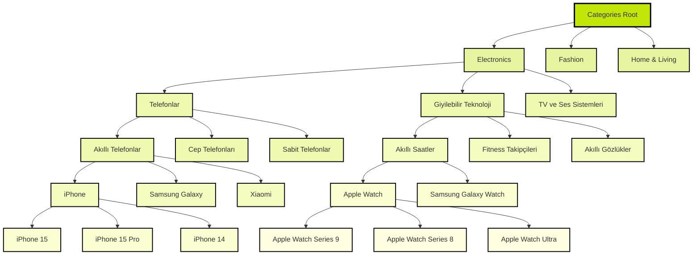

# Kategori Navigasyon Akışı ve Hiyerarşi Yapısı

Bu doküman, katalog sistemindeki kategori hiyerarşisi ve navigasyon akışını detaylı olarak açıklar.

## 📋 İçindekiler

1. [Genel Bakış](#genel-bakış)
2. [Hiyerarşi Yapısı](#hiyerarşi-yapısı)
3. [Navigasyon Akışı](#navigasyon-akışı)
4. [Örnek Senaryolar](#örnek-senaryolar)
5. [Gönderi Oluşturma ve Görüntüleme](#gönderi-oluşturma-ve-görüntüleme)

---

## 🎯 Genel Bakış

Kullanıcılar, kategorilerden başlayarak giderek daha spesifik ürünlere doğru ilerleyebilir. Her seviyede, o seviyeye ait gönderileri görüntüleyebilir veya yeni gönderi oluşturabilir.

**Temel Prensipler:**
- Her seviye, bir üst seviyeye ait alt kategorileri/ürünleri gösterir
- Her seviyede gönderi oluşturma ve görüntüleme yapılabilir
- Breadcrumb navigasyon ile geri dönüş mümkündür
- Marka bağımsız kategorilerden, marka spesifik ürünlere kadar derinleşebilir

---

## 🏗️ Hiyerarşi Yapısı

### Seviye Tanımları

```
Level 0: Categories (Root)
  └── Level 1: Category (Kategori)
      └── Level 2: SubCategory (Alt Kategori)
          └── Level 3: ProductGroup (Ürün Grubu)
              └── Level 4: Product (Ürün)
                  └── Level 5: Product Variant (Ürün Varyantı - Opsiyonel)
```

### Örnek Hiyerarşi

```
Categories (Root)
  └── Electronics
      ├── Telefonlar
      │   ├── Akıllı Telefonlar
      │   │   ├── iPhone
      │   │   │   ├── iPhone 15
      │   │   │   ├── iPhone 15 Pro
      │   │   │   └── iPhone 14
      │   │   ├── Samsung
      │   │   │   ├── Galaxy S24
      │   │   │   └── Galaxy S23
      │   │   └── Xiaomi
      │   │       └── Mi 14
      │   ├── Cep Telefonları
      │   │   ├── Nokia
      │   │   ├── Samsung
      │   │   └── LG
      │   └── Sabit Telefonlar
      │       ├── Kablosuz Telefonlar
      │       └── Kablolu Telefonlar
      ├── Giyilebilir Teknoloji
      │   ├── Akıllı Saatler
      │   │   ├── Apple Watch
      │   │   │   ├── Apple Watch Series 9
      │   │   │   ├── Apple Watch Series 8
      │   │   │   └── Apple Watch Ultra
      │   │   ├── Samsung Galaxy Watch
      │   │   └── Fitbit
      │   ├── Fitness Takipçileri
      │   │   ├── Fitbit
      │   │   ├── Garmin
      │   │   └── Polar
      │   └── Akıllı Gözlükler
      │       ├── Apple Vision Pro
      │       ├── Meta Quest
      │       └── Google Glass
      └── TV ve Ses Sistemleri
          ├── Televizyonlar
          └── Hoparlörler
```

---

## 🔄 Navigasyon Akışı

### Flow Diagram



### Detaylı Hiyerarşi Grafiği



---

## 📱 Örnek Senaryolar

### Senaryo 1: Electronics → Telefonlar → Akıllı Telefonlar → Tüm Telefonlar

```
1. Kullanıcı Categories ekranında "Electronics" seçer
   → Electronics kategorisi açılır
   → Bu seviyede: "Electronics hakkında gönderi oluştur" veya "Electronics gönderilerini görüntüle"

2. Kullanıcı "Telefonlar" alt kategorisini seçer
   → Telefonlar alt kategorisi açılır
   → Bu seviyede: "Telefonlar hakkında gönderi oluştur" veya "Telefonlar gönderilerini görüntüle"
   → Alt kategoriler görüntülenir: Akıllı Telefonlar, Cep Telefonları, Sabit Telefonlar

3. Kullanıcı "Akıllı Telefonlar" alt kategorisini seçer
   → Akıllı Telefonlar alt kategorisi açılır
   → Bu seviyede: "Akıllı Telefonlar hakkında gönderi oluştur" veya "Akıllı Telefonlar gönderilerini görüntüle"
   → Tüm akıllı telefonlar listelenir (iPhone, Samsung, Xiaomi, vb.)

4. Kullanıcı herhangi bir telefonu seçebilir veya bu seviyede gönderi oluşturabilir
```

### Senaryo 1a: Electronics → Telefonlar → Cep Telefonları

```
1. Categories → Electronics
   → Context: Electronics

2. Electronics → Telefonlar
   → Context: Telefonlar
   → Alt kategoriler: Akıllı Telefonlar, Cep Telefonları, Sabit Telefonlar

3. Telefonlar → Cep Telefonları
   → Context: Cep Telefonları
   → Gönderi: "Cep Telefonları hakkında gönderiler"
   → Ürün grupları: Nokia, Samsung, LG
```

### Senaryo 1b: Electronics → Telefonlar → Sabit Telefonlar

```
1. Categories → Electronics → Telefonlar → Sabit Telefonlar
   → Context: Sabit Telefonlar
   → Gönderi: "Sabit Telefonlar hakkında gönderiler"
   → Alt kategoriler: Kablosuz Telefonlar, Kablolu Telefonlar
```

### Senaryo 2: Electronics → Giyilebilir Teknoloji → Akıllı Saatler → Apple Watch → Apple Watch Series 8

```
1. Categories → Electronics
   → Context: Electronics
   → Gönderi: "Electronics hakkında genel gönderiler"

2. Electronics → Giyilebilir Teknoloji
   → Context: Giyilebilir Teknoloji
   → Gönderi: "Giyilebilir teknoloji hakkında gönderiler"
   → Alt kategoriler: Akıllı Saatler, Fitness Takipçileri, Akıllı Gözlükler

3. Giyilebilir Teknoloji → Akıllı Saatler
   → Context: Akıllı Saatler
   → Gönderi: "Tüm akıllı saatler hakkında gönderiler"

4. Akıllı Saatler → Apple Watch
   → Context: Apple Watch (ProductGroup)
   → Gönderi: "Apple Watch hakkında gönderiler"

5. Apple Watch → Apple Watch Series 8
   → Context: Apple Watch Series 8 (Product)
   → Gönderi: "Apple Watch Series 8 hakkında gönderiler"
```

### Senaryo 2a: Electronics → Giyilebilir Teknoloji → Fitness Takipçileri

```
1. Categories → Electronics → Giyilebilir Teknoloji → Fitness Takipçileri
   → Context: Fitness Takipçileri
   → Gönderi: "Fitness Takipçileri hakkında gönderiler"
   → Ürün grupları: Fitbit, Garmin, Polar
```

### Senaryo 2b: Electronics → Giyilebilir Teknoloji → Akıllı Gözlükler

```
1. Categories → Electronics → Giyilebilir Teknoloji → Akıllı Gözlükler
   → Context: Akıllı Gözlükler
   → Gönderi: "Akıllı Gözlükler hakkında gönderiler"
   → Ürün grupları: Apple Vision Pro, Meta Quest, Google Glass
```

### Senaryo 3: Marka Bağımsız → Marka Spesifik

```
Level 1: Electronics (Marka bağımsız)
  → "Tüm elektronik ürünler hakkında gönderiler"

Level 2: Telefonlar (Marka bağımsız)
  → "Tüm telefonlar hakkında gönderiler"

Level 3: Akıllı Telefonlar (Marka bağımsız)
  → "Tüm akıllı telefonlar hakkında gönderiler"

Level 4: iPhone (Marka spesifik - ProductGroup)
  → "iPhone hakkında gönderiler"

Level 5: iPhone 15 (Model spesifik - Product)
  → "iPhone 15 hakkında gönderiler"
```

---

## ✍️ Gönderi Oluşturma ve Görüntüleme

### Her Seviyede Yapılabilecekler

| Seviye | Context Type | Gönderi Oluşturma | Gönderi Görüntüleme |
|--------|-------------|------------------|---------------------|
| **Category** | `category` | Electronics hakkında gönderi oluştur | Electronics'e ait tüm gönderiler |
| **SubCategory** | `subcategory` | Telefonlar, Akıllı Telefonlar, Cep Telefonları, Sabit Telefonlar, Giyilebilir Teknoloji, Akıllı Saatler, Fitness Takipçileri, Akıllı Gözlükler hakkında gönderi oluştur | İlgili alt kategoriye ait tüm gönderiler |
| **ProductGroup** | `productGroup` | iPhone hakkında gönderi oluştur | iPhone'e ait tüm gönderiler |
| **Product** | `product` | iPhone 15 hakkında gönderi oluştur | iPhone 15'e ait tüm gönderiler |
| **Product Variant** | `productVariant` | iPhone 15 Pro Max 256GB hakkında gönderi oluştur | iPhone 15 Pro Max 256GB'ye ait tüm gönderiler |

### Context Data Yapısı

Her seviyede gönderi oluşturulurken, context bilgisi şu şekilde olmalıdır:

```typescript
// Category seviyesi
{
  contextType: 'category',
  contextData: {
    id: 'electronics',
    name: 'Electronics',
    type: 'category'
  }
}

// SubCategory seviyesi (Telefonlar)
{
  contextType: 'subcategory',
  contextData: {
    id: 'phones',
    name: 'Telefonlar',
    type: 'subcategory',
    parentCategory: {
      id: 'electronics',
      name: 'Electronics'
    }
  }
}

// SubCategory seviyesi (Akıllı Telefonlar)
{
  contextType: 'subcategory',
  contextData: {
    id: 'smartphones',
    name: 'Akıllı Telefonlar',
    type: 'subcategory',
    parentCategory: {
      id: 'phones',
      name: 'Telefonlar'
    }
  }
}

// SubCategory seviyesi (Cep Telefonları)
{
  contextType: 'subcategory',
  contextData: {
    id: 'feature-phones',
    name: 'Cep Telefonları',
    type: 'subcategory',
    parentCategory: {
      id: 'phones',
      name: 'Telefonlar'
    }
  }
}

// SubCategory seviyesi (Sabit Telefonlar)
{
  contextType: 'subcategory',
  contextData: {
    id: 'landline-phones',
    name: 'Sabit Telefonlar',
    type: 'subcategory',
    parentCategory: {
      id: 'phones',
      name: 'Telefonlar'
    }
  }
}

// SubCategory seviyesi (Fitness Takipçileri)
{
  contextType: 'subcategory',
  contextData: {
    id: 'fitness-trackers',
    name: 'Fitness Takipçileri',
    type: 'subcategory',
    parentCategory: {
      id: 'wearable-tech',
      name: 'Giyilebilir Teknoloji'
    }
  }
}

// SubCategory seviyesi (Akıllı Gözlükler)
{
  contextType: 'subcategory',
  contextData: {
    id: 'smart-glasses',
    name: 'Akıllı Gözlükler',
    type: 'subcategory',
    parentCategory: {
      id: 'wearable-tech',
      name: 'Giyilebilir Teknoloji'
    }
  }
}

// ProductGroup seviyesi
{
  contextType: 'productGroup',
  contextData: {
    id: 'iphone',
    name: 'iPhone',
    type: 'productGroup',
    parentSubCategory: {
      id: 'smartphones',
      name: 'Akıllı Telefonlar'
    }
  }
}

// Product seviyesi
{
  contextType: 'product',
  contextData: {
    id: 'iphone-15',
    name: 'iPhone 15',
    subName: 'Apple',
    image: '...',
    type: 'product',
    parentProductGroup: {
      id: 'iphone',
      name: 'iPhone'
    }
  }
}
```

### Breadcrumb Navigasyon

Her seviyede breadcrumb gösterilir ve kullanıcı geri dönebilir:

```
Categories > Electronics > Telefonlar > Akıllı Telefonlar > iPhone > iPhone 15
```

- Her breadcrumb item'ına tıklanabilir
- Tıklanan seviyeye geri dönülür
- O seviyeye ait gönderiler ve alt kategoriler gösterilir

---

## 🎨 UI/UX Önerileri

### Her Seviyede Gösterilecekler

1. **Breadcrumb Bar** (Üstte)
   - Mevcut navigasyon yolunu gösterir
   - Her item'a tıklanabilir

2. **Action Buttons** (Üstte veya Floating)
   - "Gönderi Oluştur" butonu
   - "Gönderileri Görüntüle" butonu

3. **Content Area**
   - Alt kategoriler/ürünler grid veya list formatında
   - Her item'da:
     - Görsel
     - İsim
     - Alt öğe sayısı (varsa)
     - Gönderi sayısı

4. **Filter/Search** (Opsiyonel)
   - Arama çubuğu
   - Filtreleme seçenekleri

---

## 🔧 Teknik Detaylar

### State Management

```typescript
interface CatalogNavigationState {
  // Breadcrumb
  breadcrumbItems: BreadcrumbItem[];
  
  // Seçili seviyeler
  selectedCategoryId?: string;
  selectedSubCategoryId?: string;
  selectedProductGroupId?: string;
  selectedProductId?: string;
  
  // Mevcut görünüm
  currentView: 'categories' | 'subcategories' | 'productgroups' | 'products';
  
  // Arama
  searchQuery: string;
}
```

### API Endpoints (Örnek)

```
GET /api/catalog/categories
GET /api/catalog/categories/:categoryId/subcategories
GET /api/catalog/subcategories/:subCategoryId/productgroups
GET /api/catalog/productgroups/:productGroupId/products
GET /api/catalog/products/:productId

GET /api/posts?contextType=category&contextId=electronics
GET /api/posts?contextType=subcategory&contextId=phones
GET /api/posts?contextType=subcategory&contextId=smartphones
GET /api/posts?contextType=subcategory&contextId=feature-phones
GET /api/posts?contextType=subcategory&contextId=landline-phones
GET /api/posts?contextType=subcategory&contextId=wearable-tech
GET /api/posts?contextType=subcategory&contextId=smart-watches
GET /api/posts?contextType=subcategory&contextId=fitness-trackers
GET /api/posts?contextType=subcategory&contextId=smart-glasses
GET /api/posts?contextType=productGroup&contextId=iphone
GET /api/posts?contextType=product&contextId=iphone-15
```

### Navigation Routes

```typescript
type CatalogStackParamList = {
  CatalogScreen: undefined;
  CategoryDetailScreen: { categoryId: string };
  SubCategoryDetailScreen: { subCategoryId: string };
  ProductGroupDetailScreen: { productGroupId: string };
  ProductDetailScreen: { productId: string };
  CategoryPostsScreen: { categoryId: string };
  SubCategoryPostsScreen: { subCategoryId: string };
  ProductGroupPostsScreen: { productGroupId: string };
  ProductPostsScreen: { productId: string };
};
```

---

## 📝 Notlar

- Her seviye, bir üst seviyenin alt öğelerini gösterir
- Gönderi oluşturma her seviyede mümkündür
- Gönderi görüntüleme, seçili context'e göre filtrelenir
- Breadcrumb navigasyon ile herhangi bir seviyeye geri dönülebilir
- Marka bağımsız kategorilerden, marka spesifik ürünlere kadar derinleşme mümkündür

---

**Son Güncelleme:** 2024-12-19
